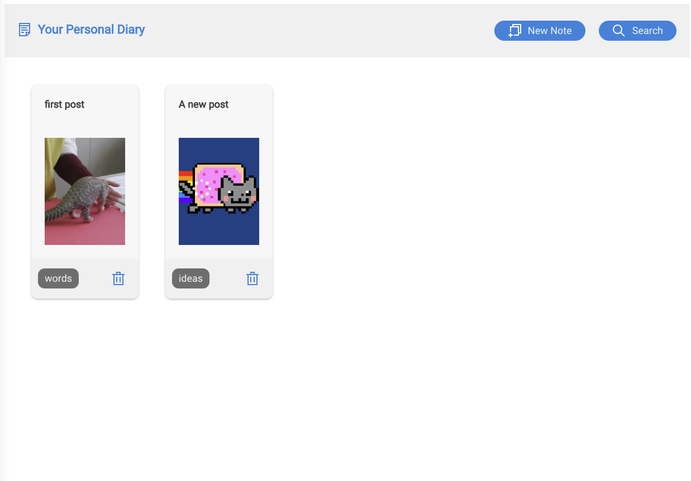

# Platform Rest API

A backend for my previous platform Lab 4

[frontend](https://wondrous-rugelach-49b91a.netlify.app)
[backend](https://platform-rest-api-g74q.onrender.com)

## What Worked Well

- Overall, implementing the API went relatively smoothly. I didn't encounter many big errors, and Insomnia and Compass were super super useful when debugging.

## What Didn't

- Working with the mongoose functions was sometimes not as intutitive as I assumed (specifically, it took me a while to notice that the find function used in getting a specific post returns null but does not throw an error when passed a bad id)

## Extra Credit

- For extra credit, I implemented search. Users can search through titles, content, and tags

## Screenshots

- New search feature

